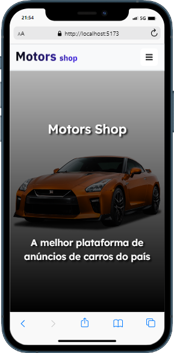
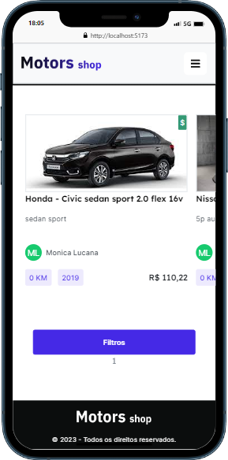
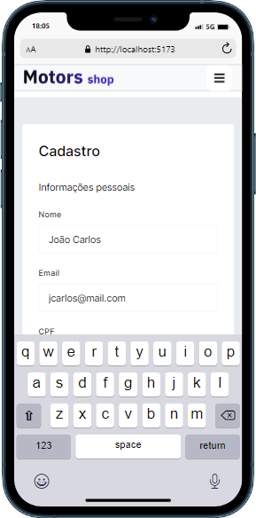
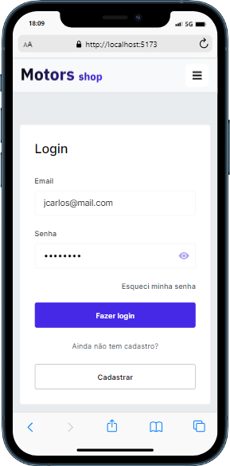
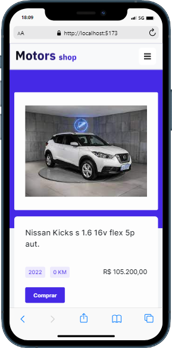
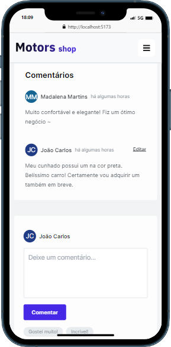
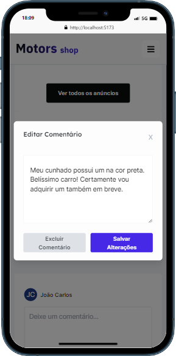
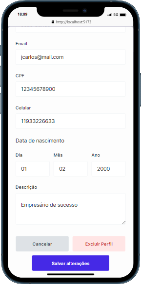
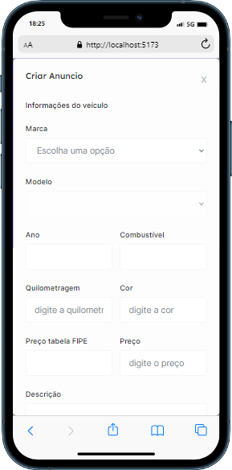

# Projeto Full Stack Motors Shop


Projeto Final de conclusão do curso Full Stack da Kenzie Academy Brasil desenvolvido em grupo.

Uma aplicação de compra e venda de veículos.

## Índice

- <a href="#-instalar">Instalando e rodando o projeto</a>
- <a href="#-funcionalidades">Funcionalidades</a>
- <a href="#-layout">Layout</a>
- <a href="#-bibliotecas">Bibliotecas utilizadas</a>
- <a href="#-ferramentas">Ferramentas</a>
- <a href="#-interagir">Como interagir com o projeto</a>
- <a href="#-contribuidoras">Pessoas contribuidoras</a>

## Instalando e rodando o projeto

```bash
# Instale as dependências:
$ npm install

# Execute a aplicação:
$ npm run dev

# Acesse pelo seu navegador:
$ http://localhost:5173/
```

## Funcionalidades

### Gerais

- Cadastro e Login de usuários (Anunciante e Comprador);
- Editar perfil;
- Filtrar veículos por marca, modelo, etc;
- Visualizar e adicionar/excluir/editar comentários no anúncio;
- Botão para compra de veículo que redireciona para o contato do Anunciante;

### Anunciante

- Cadastrar/Editar/Excluir um anúncio;

## Layout

<div>
    
    
    
    
    
    
    
    
    
</div>

## Bibliotecas utilizadas

- [x] React
- [x] Tailwind
- [x] React-hook-form
- [x] Zod
- [x] Axios
- [x] React-router-dom

## Ferramentas

- [x] VS CODE
- [x] GitHub
- [x] GIT
- [x] TypeScript
- [x] Notion
- [x] JIRA

## Como interagir com o projeto

[Clique aqui](https://github.com/vehicle-dealership/back-end) para acessar o repositório da API relacionada a este projeto.

## Pessoas contribuidoras

- [Antonio Augusto](https://github.com/AntonioAugustoRezende)
- [Lucca Haddad](https://github.com/LuccaHaddadSerejo)
- [Tamir S. Ferreira](https://github.com/tamir-ferreira)
- [Monica Lucana](https://github.com/lucana-m)
- [Miguel Napolitano](https://github.com/Miguelnapolitano)
